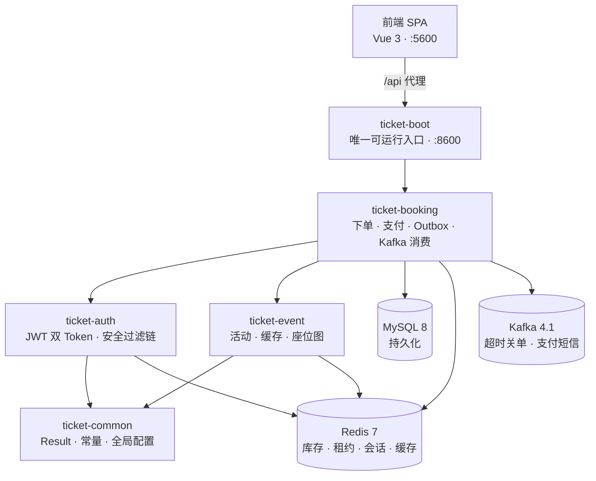
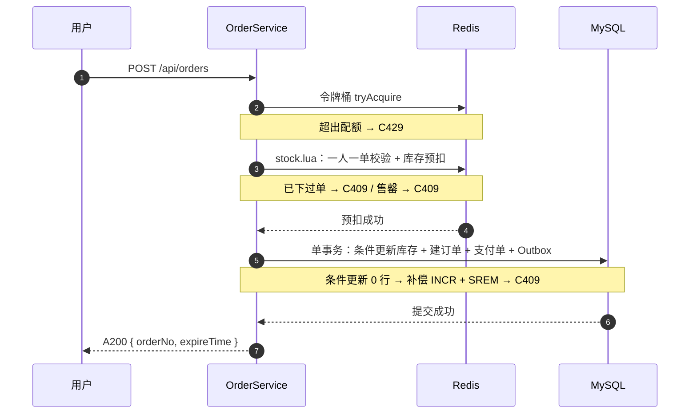
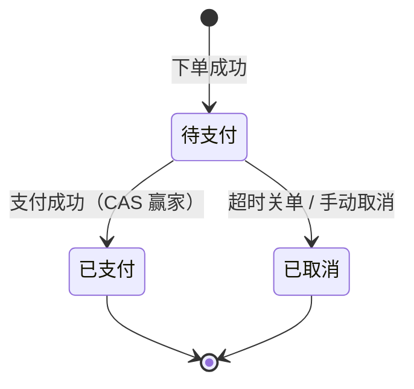

# Ticket-System 高并发票务系统

[](https://openjdk.org/projects/jdk/21/)
[](https://spring.io/projects/spring-boot)
[](https://vuejs.org/)
[](https://kafka.apache.org/)

支持**抢票**与**选座**双模式购票的高并发票务系统，覆盖下单、支付、超时关单全链路，核心解决热点并发下的**防超卖**与**消息可靠性**。

典型秒杀场景：同一活动的库存在极短时间内被大量请求争抢，任何一处竞态、锁失效或消息丢失都会直接变成超卖或死单。

## 技术亮点

**抢票秒杀：Lua 原子预扣 + DB 条件更新双层兜底**
一人一单校验与库存扣减合并在单个 Lua 脚本内原子完成，消除「先查再改」之间的竞态窗口。Redis 放行不等于 DB 一定扣得到，落库时再以条件更新（`WHERE stock > 0`）作第二层兜底；影响 0 行即判定失败，并补偿归还 Redis 预扣，避免两个数据源永久漂移。

**选座锁定：SET NX EX 座位租约**
一条 `SET NX EX` 原子完成「检测-抢占-限时」。租约 TTL 与订单有效期严格相等，不存在「锁先于订单过期」的窗口。下单只拿租约、不动座位状态，转「已售」发生在支付成功时 —— 取消与关单因此无需回滚 DB，少一条必须与 Redis 释放同生共死的写操作。

**可靠消息：Outbox 模式消除宕机丢失窗口**
关单消息与订单在同一 DB 事务内落库，根除「业务已落库、消息未发出」的丢失窗口。中继投递并等待 broker ack 后才标记已投递，失败则下轮重投（至少一次）。消费端不引入去重表 —— 关单本身是 CAS，重复消费天然幂等；另有定时任务兜底扫描，不留永久卡在待支付的死单。

**认证：JWT 双 Token**
短 Access（无状态，30 分钟）支撑高并发鉴权，长 Refresh（存 Redis，7 天）管控会话。刷新时轮换旧令牌即时失效以堵住重放，改密批量失效该用户全部会话。

**缓存与限流：Cache-Aside 三大问题 + 座位图 Bitmap**
穿透用空标记、击穿用互斥锁 + 双重检查、雪崩用 TTL 随机抖动。座位图已售状态用 Redis Bitmap 承载高频刷新，锁定中的座位则实时探测租约键（租约有 TTL，缓存它会在过期边界展示错的座位）。下单入口由 Redisson `RRateLimiter`（内部即 Lua 原子令牌桶）把守。

**支付竞态：状态机 + CAS 仲裁**
支付回调与超时关单共用同一条 `UPDATE ... WHERE status = 0`，由数据库行锁串行化，先到者生效、输家见状态已变即退出。回调重投是常态而非错误，因此重复投递返回成功而非冲突。

## 架构



模块依赖单向：`ticket-boot → ticket-booking → { ticket-auth, ticket-event } → ticket-common`。业务模块是普通库，聚合进唯一可运行的应用。

**技术栈**：Java 21 · Spring Boot 3.5.16 · Spring Security + JJWT · MyBatis-Plus 3.5.17 · MySQL 8 · Redis 7 + Redisson 3.52 · Kafka 4.1（KRaft）· Prometheus + Grafana

**前端**：Vue 3 · TypeScript · Vite · pnpm · Tailwind CSS 4 · shadcn-vue · Pinia

## 快速开始

**前置**：JDK 21、Docker（含 Compose）、Node 20+ 与 pnpm。

```bash
# 1. 基础设施（后端依赖全部五个服务）
cd deploy/docker
cp .env.example .env      # 已有 .env 则跳过
docker compose up -d      # MySQL 3306 · Redis 6379 · Kafka 9092 · Prometheus 9090 · Grafana 3000

# 2. 后端
./mvnw -DskipTests install             # spring-boot:run 前必须先安装到本地仓库
./mvnw spring-boot:run -pl ticket-boot # :8600

# 3. 前端
cd frontend && pnpm install && pnpm dev # :5600
```

浏览器打开 <http://localhost:5600>。

演示账号：`13800000001` / `Aa123456`（常规账号）；`13800000002` 无密码，仅短信登录。种子数据含 6 个活动，抢票与选座各 3 个。

**拿验证码**：项目未接入短信服务商，默认验证码打印到后端控制台（`[mock 短信] phone=... code=...`）；设 `SMS_ECHO_CODE=true` 则改为随响应体回传。

> 种子数据仅在 MySQL 数据卷**首次**初始化时写入。改动建表或种子后需 `docker compose down -v` 重建。生产部署务必覆盖 `JWT_SECRET`。

## 核心链路





超时关单与支付并发时只会有一个赢家：支付先到则订单转已支付并固化座位；关单先到则订单转已取消、归还库存与租约，支付侧返回 `C409` 且不做任何资源变更。

## 项目结构

```
├── ticket-common/    # Result 封装、异常、实体、常量、全局配置；统一声明技术栈依赖
├── ticket-auth/      # 认证：JWT 双 Token、安全过滤链、短信验证码
├── ticket-event/     # 活动：查询、Cache-Aside 缓存、座位图
├── ticket-booking/   # 购票：下单策略、支付、Outbox、Kafka 消费者
├── ticket-boot/      # 启动模块：唯一可运行入口
├── frontend/         # Vue 3 前端
├── docs/             # API 契约 + 设计图
└── deploy/           # docker-compose、schema/seed、Prometheus、Grafana
```

模块内统一为 `controller → service → mapper` 分层，请求体在 `dto/`、响应体在 `vo/`。

## 设计文档

- [`docs/API.md`](docs/API.md) —— 前后端接口契约
- [`deploy/db/schema.sql`](deploy/db/schema.sql) —— 建表语句
- [`docs/diagrams/`](docs/diagrams/README.md) —— 架构图、ER 图、订单状态机、认证 / 下单 / 支付 / 超时关单四张时序图
